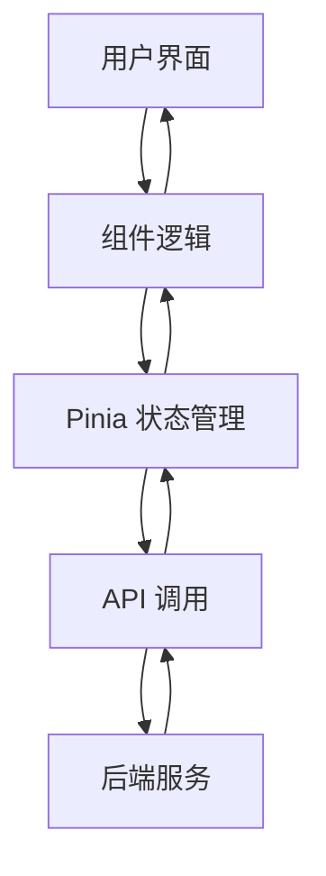

# 前端架构设计文档

## 1. 技术栈选择

### 1.1 核心框架
- **框架**：Uni-app (Vue 3)
- **语法**：Vue 3 Composition API
- **样式**：SCSS/SASS
- **UI库**：uni-ui (优先) + uView (复杂组件)

### 1.2 工具库
- **状态管理**：Pinia
- **网络请求**：axios (封装)
- **路由管理**：Uni-app 内置路由
- **工具函数**：lodash-es
- **日期处理**：dayjs
- **图片处理**：uni.chooseImage + 压缩处理

## 2. 目录结构设计

### 2.1 整体结构
```
delivery-platform/
├── miniapp/                # Uni-app 小程序前端
│   ├── api/                # 接口请求中心
│   ├── components/         # 全局复用组件
│   ├── pages/              # 页面目录
│   │   ├── auth/           # 认证相关页面
│   │   ├── home/           # 首页相关页面
│   │   ├── product/        # 商品相关页面
│   │   ├── order/          # 订单相关页面
│   │   ├── user/           # 用户相关页面
│   │   ├── carpool/        # 顺风车相关页面
│   │   └── alliance/       # 百商联盟相关页面
│   ├── static/             # 静态资源
│   ├── store/              # Pinia 状态管理
│   ├── utils/              # 工具函数
│   ├── common/             # 公共配置
│   ├── styles/             # 全局样式
│   ├── main.js             # 入口文件
│   ├── App.vue             # 根组件
│   └── pages.json          # 页面配置
└── docs/                   # 项目文档
```

### 2.2 模块划分

#### 2.2.1 核心模块
- **用户体系**：登录、注册、个人中心、地址管理
- **本地百货**：首页、商品列表、商品详情、商家主页
- **配送预约**：订单确认、支付、订单列表、订单详情
- **百商联盟**：联盟商家、优惠券、入驻申请
- **乡村顺风车**：行程发布、行程搜索、预约管理

## 3. 架构设计

### 3.1 数据流设计



### 3.2 网络请求封装
- **统一拦截器**：处理 token、错误统一处理
- **请求方法**：GET、POST、PUT、DELETE
- **响应格式**：统一处理后端返回的 `{ code, msg, data }` 格式

### 3.3 状态管理设计
- **用户状态**：用户信息、登录状态、权限
- **商品状态**：商品列表、搜索条件、购物车
- **订单状态**：订单列表、订单详情、支付状态
- **全局状态**：系统配置、消息通知

## 4. 核心功能模块设计

### 4.1 用户体系
- **登录/注册**：手机号验证码登录、微信一键登录
- **个人中心**：用户信息展示、角色管理、地址管理
- **实名认证**：身份证验证、车主认证

### 4.2 本地百货
- **首页**：轮播图、分类入口、热门商品、联盟优惠
- **商品列表**：分类浏览、搜索筛选、排序
- **商品详情**：图片轮播、规格选择、商家信息、评价
- **购物车**：商品管理、批量操作、结算

### 4.3 配送预约
- **确认订单**：地址选择、配送方式、优惠券、支付方式
- **订单列表**：状态筛选、订单跟踪
- **订单详情**：商品清单、配送信息、费用明细

### 4.4 百商联盟
- **联盟商家**：商家列表、商家详情
- **优惠券**：领券、用券、我的优惠券
- **入驻申请**：店铺信息、资质上传、协议签署

### 4.5 乡村顺风车
- **行程发布**：出发地、目的地、时间、费用设置
- **行程搜索**：按条件搜索、行程详情
- **预约管理**：申请搭乘、车主确认、行程跟踪

## 5. 性能优化策略

### 5.1 加载优化
- **首页加载**：控制在 2 秒内
- **图片优化**：上传压缩、懒加载、CDN 加速
- **代码分割**：按需加载页面组件
- **缓存策略**：本地缓存常用数据

### 5.2 交互优化
- **骨架屏**：加载过程显示骨架屏
- **防抖节流**：搜索输入、滚动事件
- **预加载**：预加载可能访问的页面
- **动画效果**：流畅的过渡动画

## 6. 开发计划

### 6.1 第一阶段（2周）
- 项目初始化和配置
- 用户体系核心功能
- 首页和商品列表

### 6.2 第二阶段（2周）
- 商品详情和购物车
- 订单流程和支付
- 百商联盟基础功能

### 6.3 第三阶段（1周）
- 乡村顺风车功能
- 测试和性能优化
- 部署和上线准备

## 7. 技术实现要点

### 7.1 微信小程序适配
- 小程序权限管理
- 微信支付集成
- 地图功能集成
- 消息通知

### 7.2 跨平台兼容
- 适配不同尺寸设备
- 处理平台差异
- 确保在iOS和Android上表现一致

### 7.3 安全性
- 数据加密传输
- 敏感信息处理
- 防止XSS攻击
- 权限控制

## 8. 设计风格

### 8.1 整体风格
- **现代简约**：清晰的视觉层次，简洁的界面设计
- **适老化**：大字体、高对比度、简单操作流程
- **地方特色**：适当融入地方文化元素

### 8.2 色彩方案
- **主色调**：绿色系（代表乡村、自然、信任）
- **辅助色**：橙色系（代表活力、温暖）
- **中性色**：白色、浅灰、深灰

### 8.3 字体方案
- **标题**：18-20px，加粗
- **正文**：14-16px，常规
- **辅助文字**：12-13px，浅色

## 9. 测试计划

### 9.1 功能测试
- 核心流程测试
- 边界情况测试
- 异常处理测试

### 9.2 性能测试
- 加载速度测试
- 响应时间测试
- 内存占用测试

### 9.3 兼容性测试
- 不同微信版本测试
- 不同设备型号测试
- 不同网络环境测试

## 10. 部署和上线

### 10.1 构建流程
- 代码压缩
- 资源优化
- 版本管理

### 10.2 发布流程
- 微信小程序审核
- 灰度发布
- 全量发布

### 10.3 监控和运维
- 用户行为分析
- 错误监控
- 性能监控

## 11. 结论

本前端架构设计文档基于项目需求和技术要求，采用Uni-app (Vue 3)技术栈，设计了清晰的目录结构和功能模块，制定了合理的开发计划和性能优化策略。通过本设计，我们可以在1个月内完成前端开发，实现所有核心功能，并确保良好的用户体验和性能表现。