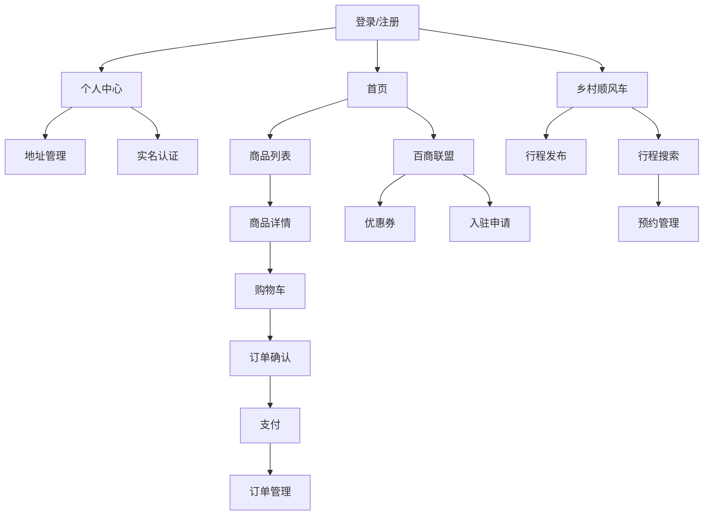

# 前端开发计划

## 1. 开发阶段划分

### 1.1 第一阶段：基础架构和核心功能（2周）

#### 第1周：项目初始化和用户体系
- **Day 1-2**：项目初始化、配置搭建
  - 创建Uni-app项目
  - 配置基础依赖
  - 搭建目录结构
  - 配置全局样式和主题

- **Day 3-4**：用户认证功能
  - 登录/注册页面
  - 手机号验证码登录
  - 微信一键登录
  - 登录状态管理

- **Day 5-7**：个人中心和地址管理
  - 个人中心页面
  - 用户信息展示和编辑
  - 收货地址管理
  - 实名认证功能

#### 第2周：首页和商品列表
- **Day 8-10**：首页功能
  - 轮播图组件
  - 分类入口
  - 热门商品展示
  - 百商联盟专区

- **Day 11-14**：商品列表和搜索
  - 商品列表页面
  - 分类筛选
  - 搜索功能
  - 排序功能

### 1.2 第二阶段：核心业务功能（2周）

#### 第3周：商品详情和购物车
- **Day 15-17**：商品详情页
  - 商品图片轮播
  - 规格选择
  - 商家信息展示
  - 商品评价

- **Day 18-21**：购物车功能
  - 购物车页面
  - 商品管理
  - 批量操作
  - 结算功能

#### 第4周：订单流程和支付
- **Day 22-24**：订单确认页面
  - 地址选择
  - 配送方式选择
  - 优惠券使用
  - 费用计算

- **Day 25-28**：订单管理和支付
  - 订单列表页面
  - 订单详情页面
  - 微信支付集成
  - 订单状态跟踪

### 1.3 第三阶段：扩展功能和优化（1周）

#### 第5周：扩展功能和优化
- **Day 29-31**：百商联盟功能
  - 联盟商家列表
  - 优惠券管理
  - 入驻申请页面

- **Day 32-35**：乡村顺风车功能
  - 行程发布页面
  - 行程搜索页面
  - 预约管理功能

- **Day 36-40**：测试和优化
  - 功能测试
  - 性能优化
  - 兼容性测试
  - 部署和上线准备

## 2. 核心功能开发顺序

### 2.1 优先级排序

1. **用户体系**（P0）
   - 登录/注册
   - 个人中心
   - 地址管理
   - 实名认证

2. **本地百货**（P0）
   - 首页
   - 商品列表
   - 商品详情
   - 购物车

3. **配送预约**（P1）
   - 订单确认
   - 支付
   - 订单管理

4. **百商联盟**（P1）
   - 联盟商家
   - 优惠券
   - 入驻申请

5. **乡村顺风车**（P2）
   - 行程发布
   - 行程搜索
   - 预约管理

### 2.2 功能依赖关系

## 3. 技术实现方案

### 3.1 项目初始化
- 使用HBuilderX创建Uni-app项目
- 配置Vue 3 Composition API
- 安装必要的依赖包
- 设置ESLint和Prettier

### 3.2 网络请求封装
- 创建axios实例
- 配置请求拦截器和响应拦截器
- 统一处理错误和异常
- 实现API接口管理

### 3.3 状态管理
- 使用Pinia创建store
- 设计用户、商品、订单等状态
- 实现状态持久化

### 3.4 组件开发
- 封装通用组件（轮播图、商品卡片、地址选择等）
- 实现页面级组件
- 确保组件的可复用性

### 3.5 性能优化
- 图片压缩和懒加载
- 代码分割和按需加载
- 缓存策略
- 骨架屏和加载状态

## 4. 测试计划

### 4.1 功能测试
- 核心流程测试（登录、购物、支付）
- 边界情况测试（空数据、异常输入）
- 错误处理测试（网络错误、服务器错误）

### 4.2 性能测试
- 首页加载速度
- 商品列表加载速度
- 页面切换流畅度
- 内存占用

### 4.3 兼容性测试
- 不同微信版本
- 不同设备型号
- 不同网络环境

## 5. 部署和上线

### 5.1 构建流程
- 代码压缩和优化
- 资源文件处理
- 版本管理

### 5.2 发布流程
- 微信小程序审核
- 灰度发布
- 全量发布

### 5.3 监控和运维
- 用户行为分析
- 错误监控
- 性能监控

## 6. 风险评估和应对策略

### 6.1 风险因素
- 开发时间紧张
- 功能需求变更
- 后端API接口延迟
- 微信小程序审核

### 6.2 应对策略
- 优先级排序，确保核心功能优先完成
- 建立变更管理机制
- 与后端团队保持密切沟通
- 提前准备审核材料，确保符合微信小程序规范

## 7. 团队协作

### 7.1 开发规范
- 代码风格统一
- 提交信息规范
- 分支管理策略
- 代码审查流程

### 7.2 沟通机制
- 每日站会
- 周例会
- 问题及时反馈
- 文档共享

## 8. 结论

本开发计划基于项目需求和技术要求，制定了详细的开发阶段和功能实现顺序。通过合理的时间规划和优先级排序，我们可以在1个月内完成前端开发，实现所有核心功能，并确保良好的用户体验和性能表现。同时，我们也考虑了可能的风险因素和应对策略，以确保项目能够顺利进行。